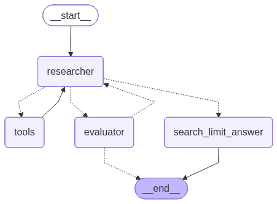

# Agentic Research Assistant

A LangGraph-based research agent that iteratively searches the web and refines answers using a **ReAct (Reasoning + Acting)** loop with evaluation gating. Powered by Ollama for local LLM inference and LangSmith for observability.

## Agent Graph



The agent follows this flow:

- **Researcher** reasons about the query and decides to search or respond
- **Tools** executes web searches via DuckDuckGo
- **Evaluator** validates response quality — if insufficient, sends the researcher back with feedback
- **Search Limit Answer** produces a final answer only when the max search limit (10) is reached

When the evaluator marks a response as sufficient, the researcher's answer goes directly to the output.

## Prerequisites

- [Python 3.13+](https://www.python.org/)
- [uv](https://docs.astral.sh/uv/) for dependency management
- [Ollama](https://ollama.com/) running locally
- A model pulled in Ollama (default: `llama3.2`)

## Setup

1. Clone the repository and install dependencies:

```bash
uv sync
```

2. Copy the environment template and configure your settings:

```bash
cp .env.example .env
```

Required environment variables:

| Variable | Description | Default |
|---|---|---|
| `OLLAMA_BASE_URL` | Ollama server URL | `http://localhost:11434` |
| `OLLAMA_API_KEY` | Ollama API key | — |
| `MODEL_NAME` | LLM model name | `llama3.2` |
| `LANGSMITH_TRACING` | Enable LangSmith tracing | `true` |
| `LANGSMITH_API_KEY` | LangSmith API key | — |
| `LANGCHAIN_PROJECT` | LangSmith project name | `agentic-template` |

3. Make sure Ollama is running locally with your model pulled:

```bash
ollama pull llama3.2
```

## Usage

Run the agent with a query:

```bash
python -m src.main --query "What is LangGraph?"
```

Or launch interactively:

```bash
python -m src.main
```

Visualize the agent graph:

```bash
python -m src.main --visualize
```

Run LangGraph dev server (opens LangSmith Studio):

```bash
langgraph dev
```

Run tests:

```bash
uv run pytest
```

## Project Structure

```
src/
├── main.py                    # CLI entry point (rich console output)
├── settings.py                # Pydantic BaseSettings from .env
├── ollama_client.py           # ChatOllama factory
├── state.py                   # AgentState + EvaluationConstants
├── prompts.py                 # All prompt templates
├── tools/
│   ├── __init__.py
│   └── web_search.py          # DuckDuckGo @tool
├── nodes/
│   ├── __init__.py
│   ├── researcher.py          # Reasoning + tool calling
│   ├── evaluator.py           # Response quality validation
│   └── search_limit_answer.py # Fallback when max searches hit
└── agents/
    ├── __init__.py
    └── researcher.py          # Graph wiring (StateGraph, edges, compile)
```

## Tech Stack

- **[LangGraph](https://github.com/langchain-ai/langgraph)** — Agent orchestration
- **[LangChain](https://github.com/langchain-ai/langchain)** — LLM framework
- **[Ollama](https://ollama.com/)** — Local LLM inference
- **[LangSmith](https://smith.langchain.com/)** — Observability and tracing
- **[Rich](https://github.com/Textualize/rich)** — Terminal output with Markdown rendering
- **[DuckDuckGo](https://duckduckgo.com/)** — Web search tool
